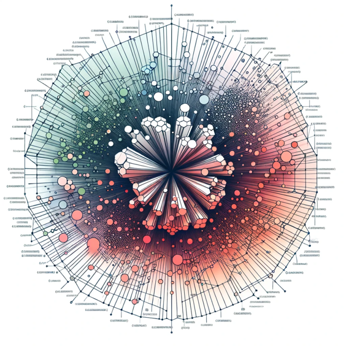

Hello, my name is Alice, and I have about two decades of experience in ABAP/SAP and a lifelong passion for programming.

I wanted to share my recent PoC project/library with you.  
It's a simple yet fast Vector DB implemented entirely in ABAP (and one table, any DB).  
It turned out that a) it is possible and b) it is "good enough" to replace external solutions in specific scenarios.

Let me show you =)

## TL;DR:

GitHub:[oisee/zvdb: ABAP Vector Search Library (github.com)](https://github.com/oisee/zvdb)

## What problem are we trying to solve

So, what problem are we trying to solve?  
The library serves as a straightforward, in-house alternative to third-party vector databases. This is particularly useful if you require semantic search capabilities directly on the ABAP application server.  
This tool can enhance your RAG (Retrieval Augmented Generation) applications, along with other heuristics.

***(Disclaimer: This project was completed before the recent [OpenAI developer conference](https://openai.com/blog/new-models-and-developer-products-announced-at-devday), meaning it predates their introduction of "Assistant API" and "GPTs." While the latest OpenAI API now supports knowledge-based RAG without external VDBs, this solution may still be relevant, especially for RAG implementations using the Azure OpenAI API.
And it is still relevant if you are going to use alternative LLM-based API: opensource llama-2/codellama/mistral/zephyr with inference API on top of https://lmstudio.ai/ or  https://ollama.ai/)***

*(More info on RAG:* [*text*](https://learn.microsoft.com/en-us/azure/search/retrieval-augmented-generation-overview) [*video)*](https://www.youtube.com/watch?v=T-D1OfcDW1M)

RAG is the technique that is powering the “chat with your documents” scenario:

-   Slice documents into chunks
-   Generate vector embedding for these chunks
-   When answer the question, search for semantically relevant chunks in DB,
-   Inject semantically relevant chunks into the Prompt, something like:
```
Considering only the information below:
###
{chunk01}
{chunk02}
{chunk03}
###
please provide a response to the following request:
{query from user}
```

## Validation: "GOOD ENOUGH"

The practicality of the ABAP Vector Search Library will be validated based on the following criteria:

-   Local Query Time **less** Call to External VDB – excellent
-   Local Query Time **less** \~10% of the LLM response time - OK

-   Volume-Based Criteria: Should handle at least \~10 books
    -   =\> 10 \* 300 pages = 3000 embeddings

Local Query Time: The time required to perform a local query using the library should be significantly less than when it calls an external third-party Vector Database, typically hosted on platforms like Azure. This ensures that the library offers a practical alternative to using external services.

But the slowest part of RAG - is the response of the LLM itself, so if Query will take \~10% of the LLM response time, it is still OK.

Volume-Based Criteria: The library should be able to handle a substantial volume of vectors in the database. As a reference point, a minimal threshold for practicality could be the ability to efficiently query a dataset equivalent to several books, with the average book size being approximately 300 pages. If the library can efficiently query more than this volume (e.g., 3000 vectors or more), it can be deemed "good enough" for practical usage.

These criteria ensure that the library is efficient in terms of query time and can handle reasonably large datasets, making it a valuable tool for various applications.

## Understanding Data

Let's start with data:

Our embedding vectors are 1536-dimensional, ranging from -1 to 1. Keep in mind that these vectors may not always be unit vectors.

1536-dimensional embedding by the model [ada-002](https://platform.openai.com/docs/guides/embeddings):
 * [-7.912499859230593e-05, -0.022456586360931396, 0.018665215000510216, -0.02411365509033203, 0.0009089018567465246, 0.031524062156677246, -0.027944795787334442, 0.008245570585131645, -0.006893403362482786, -0.018983371555805206, 0.009723675437271595, 0.01825426146388054 ... ]

The measure of similarity between two vectors - [Cosine similarity](https://colab.research.google.com/drive/13P1HKjNgO14T_iLjAsTRtegsGYblicpY)

And it can be calculated as dot product (or scalar product):

**[a1,a2,a3,a4] • [b1,b2,b3,b4] = a1\*b1 + a2\*b2 + a3\*b3 + a4\*b4**

i.e. comparison of two 1536d vectors requires:
 - 1536 multiplications
 - 1536 additions

=\> 3072 operations for one comparison.

## Starting point: brute force search
The most straightforward way to find something is a brute force search: the query vector must be compared with all the vectors in DB.
Result of the each comparison – the cosine similarity can be interpreted as “rank”.
The result must be sorted, and then the top k-nearest neighbours will be the query's result.

**Pathways to Optimization**

-   **A -** Faster calculations
-   **B** - Fewer calculations

**Path A - Quantization:**

-   Quantize -1…+1 into 8bit (fine)
-   Quantize -1…+1 into 4bit (coarse)
-   Quantize -1…+1 into 1bit (extreme)


*quantization, fixed point arithmetic*

1536-dimensional embedding by ada-002:

Quantized:

-   8b: [-1, -3, 4, -4, 2, 6, -4, 3, -1, -3, 3, 4, 2, 2, -3, 2, 4, 3, 2, 3, -1, 5, 4, 4, -2, 4, 3, …] -127…+127
-   3b: [-1, -1, 2, -1, 2, 2, -1, 2, -1, -1, 2, 2, 2, 2, -1, 2, 2, 2, 2, 2, -1, 2, 2, 2, -1, 2, 2, …] -3…-3
-   1b: [-1, -1, 1, -1, 1, 1, -1, 1, -1, -1, 1, 1, 1, 1, -1, 1, 1, 1, 1, 1, -1, 1, 1, 1, -1, 1, 1, …] -1..+1

1b: sign is enough:

-   0 – is positive
-   1 – negative

**Path A - Bitwise Operations**

Bitwise multiplication is XOR: With 0 and 1 as +1 and -1:

-   **0 xor 0 = 0** *(+1 \* +1 = +1 )*
-   **1 xor 1 = 0** *(-1 \* -1 = -1 )*
-   **0 xor 1 = 1** *(1 \* -1 = -1 )*
-   **1 xor 0 = 1** *(-1 \* 1 = -1 )*

Summation is just a bit-counting operation (+1 if 0 and -1 if 1):

01010 xor 10101 = 11111, bit counting: -5

(max distance – vectors have nothing in common)

11100 xor 11100 = 00000, bit counting: +5

(min distance – vectors identical)

¡10111 xor 11111 = 01000, bit counting: +4 – 1 = 3

(some distance – almost identical – one bit of difference)

**Validation: 1b vs 8b vs fp**

Let’s do the BF search:

Calculate DP for:

-   Q1b
-   Q8b
-   Floating Point

sort the resulting rank and compare the order of results.

The order for the rank 1536 (equal) to 512 (not yet perpendicular, but far enough to stop worrying) is stable.

**Path B – NARROWING SELECTION**



*visualisation of vector clusters in 3d space*

What if we can mark similar vectors that are close?
There is a function for that! =)

Spatial HASH function:
Similar vectors are likely to end up with the same or similar hash.
(i.e. closer in lower-dimensional space)

1536d is exceptionally high:
64d (chessboard and wheat) is just 8x8 “image.”
1536s is 48x32 “image”

**Random hyperplanes method**

Slice hyperspace into two parts with a random vector
If it is “below” – 1 if it is “above” 0
As many vectors – as many digits in the hash.

**Handling Non-Uniform Distribution**

Use vectors from the dataset as hyperplanes

-   Pickup random vector
-   Find Nearest
-   Furthest
-   Mid-Point
-   Mid-Point is a highly likely perpendicular vector – good enough to be the next axis of the index (hash function)

Any other methods to speed up the search?

**Fast ranking**
We can use Dot Products between HASHes of two vectors to make ranking faster “quick force” instead of “brute force”.

## Stats

Some stats:
 
Optimization: initially it was ~3000μs for one floating-point unquantized comparison, using 1b quantization and bitwise operation it was optimized down to ~20μs, so we easily can do dot product (i.e.: do brute force search): for ~50000 vectors per second.
 
For RAG with the context window of 32k it is more than enough ^_^

**Source code: \$ZVDB.**

GitHub:[oisee/zvdb: ABAP Vector Search Library (github.com)](https://github.com/oisee/zvdb)

**About the Author:**

Alice Vinogradova is a seasoned ABAP/SAP professional with a rich background in programming, spanning from Z80 assembly to modern data processing techniques. Her passion lies in exploring and optimizing complex systems, bridging traditional computing with innovative technological advancements.
